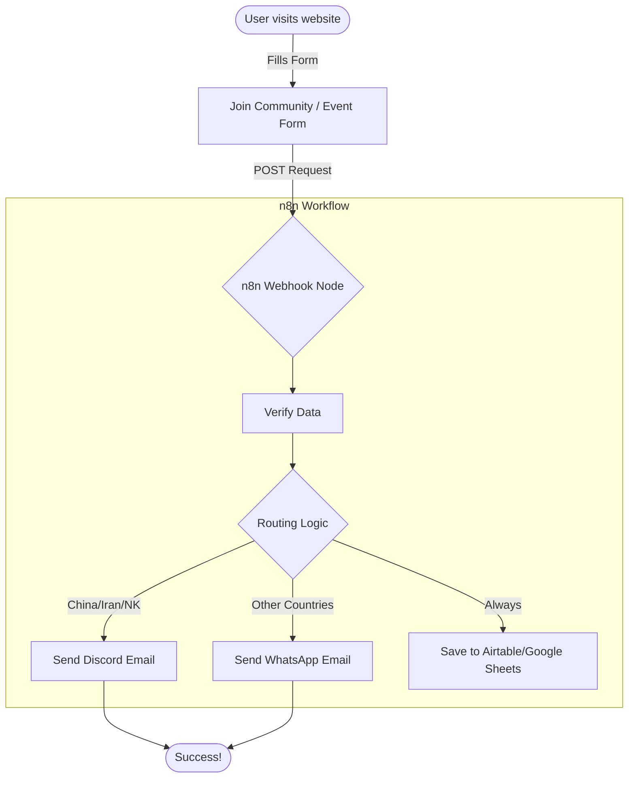

# 🧠 How TTA + n8n Works (Visual Guide)

Think of n8n as the **"Central Brain"** for your website. Your website (Next.js) only collects the info; n8n decides where it goes.

## 1. The High-Level Flow



---

## 2. The Logic nodes (Deep Dive)

Here is exactly how the nodes look inside n8n for the **Community Join Form**:

### Node 1: Webhook (The Listener)
*   **What it does:** It gives you a unique URL.
*   **Settings:**
    *   **HTTP Method:** `POST`
    *   **Respond:** `On Click` (This tells the website "I got it!")
*   **Example Data it receives:**
    ```json
    {
      "fullName": "John Doe",
      "email": "john@example.com",
      "routing": "WHATSAPP", // Calculated by the frontend
      "country": "Nigeria"
    }
    ```

### Node 2: IF Node (The Decision Maker)
*   **What it does:** It checks the `routing` value we sent from the website.
*   **Configuration:**
    *   **Condition:** `{{ $json.routing }}` **equal to** `DISCORD`.
*   **Two Paths:**
    *   **True:** User is from a restricted country.
    *   **False:** User is from a WhatsApp-friendly country.

### Node 3 & 4: Gmail/SendGrid (The Messengers)
*   **True Path:** Send an email with the subject: "Welcome! Join our Discord".
*   **False Path:** Send an email with the subject: "Welcome! Join our WhatsApp".
*   **Mapping the Recipient (The "To" Field):**
    *   To send the email to the user who filled the form, you MUST use an **Expression**.
    *   **CRITICAL**: Because the email node comes *after* the Calendar node, you must reference the **Webhook** node directly to get the user's email.
    *   In the "To" field, click the **Expression** tab and enter:
        `{{ $node["Webhook"].json.email }}`
    *   This ensures n8n looks back at the "Webhook" node instead of the "Calendar" node.
*   **Smart Info:** Use the same trick in the message body: *"Hi {{ $node["Webhook"].json.name }}, thanks for joining!"*

---

## 3. How to "Build" it (Step-by-Step)

1.  **Start n8n:** Run `npx n8n` in your terminal.
2.  **Add a Webhook Node:** This is your "Entry Point". 
3.  **Submit a "Test" form:** Go to your website, fill the form.
4.  **See the Data:** In n8n, click the Webhook node to see the "Output" — the data from your website is now there!
5.  **Connect the Action:** "Drag" a line from the Webhook node and add a **Google Sheets** node to save the data.

### Why use n8n instead of code?
*   **Visibility:** You see every failure and success in a visual timeline.
*   **Control:** To change the WhatsApp link, you just edit one node in n8n—no need to touch the website code or redeploy.
*   **Scale:** You can easily add a node that sends a Slack message to your team whenever a new person joins.
